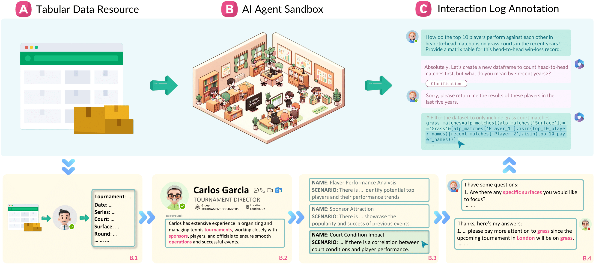

# Tapilot-Crossing: Benchmarking and Evolving LLMs Towards Interactive Data Analysis Agents


[](https://creativecommons.org/licenses/by-sa/4.0/deed.en)
[](https://huggingface.co/datasets/birdsql/tapilot-crossing/tree/main)
[](https://www.python.org/downloads/release/python-390/)
[](https://tapilot-crossing.github.io/)


<p align="center" width="100%">
<a></a>
</p>

## 🌐 Project Overview

Tapilot-Crossing is an innovative benchmark designed to evaluate Language Model (LLM) agent performance on interactive data analysis tasks. This project introduces a cost-effective way to simulate realistic user-agent interactions via DECISION COMPANY. Tapilot-Crossing includes **1094 user intents** across **952 entries** in 8 categories, spanning 5 data domains (credit card risk, ATP tennis, fast food nutrition, laptop pricing, Melbourne housing). It also features the **A**daptive **I**nteraction **R**eflection (**AIR**) strategy, aimed at improving LLM agent ability to learn from their interaction histories, leading to significant performance enhancements. This is the [data intelligence index](https://livesqlbench.ai/data-intelligence-index/) version of the benchmark.

## 🏆 Baseline Performance

We evaluate 6 LLMs on Tapilot-Crossing using the **base** (direct prompting) strategy. Results are reported as accuracy (%).

### Overall Results

| Model | Multi-Choice | Code Generation | Overall |
|-------|:---:|:---:|:---:|
| **Claude Opus 4.6** | **65.12** | **33.43** | **45.89** |
| Kimi 2.5 | 56.98 | 8.73 | 27.70 |
| Claude Sonnet 4.5 | 55.12 | 29.22 | 39.40 |
| Qwen3-Coder | 49.77 | 27.41 | 36.20 |
| GLM 4.7 | 49.30 | 5.12 | 22.49 |
| MiniMax M2.1 | 46.05 | 19.88 | 30.16 |

## 📊 Dataset Structure

### Data Categories

The benchmark comprises 8 task categories split into two evaluation modes:

#### Multi-Choice Tasks (430 intents)

| File | Intents | Category | Description |
|------|---------|----------|-------------|
| `action_analysis.jsonl` | 219 | Insight Mining | The agent interprets analysis results and extracts insights (e.g., trends, correlations) to support decision-making, beyond just generating code. |
| `action_una.jsonl` | 107 | Fast Fail | The agent detects that a question cannot be answered due to missing data or invalid assumptions and explicitly reports it. |
| `action_bg.jsonl` | 34 | Best Guess | For under-specified queries, the agent makes reasonable assumptions based on data or commonsense instead of asking for clarification. |
| `action_plotqa.jsonl` | 70 | Plot QA | The agent answers questions based on visualizations, requiring understanding of plots and relationships between variables. |

#### Code Generation Tasks (664 intents)

| File | Intents | Category | Description |
|------|---------|----------|-------------|
| `normal.jsonl` | 361 | Normal | Fully specified queries where no interaction or clarification is needed; the agent directly produces code or answers. |
| `private.jsonl` | 267 | Private | Involves user-defined/private libraries. Tests the agent's ability to understand and use unseen APIs rather than relying on standard libraries. |
| `action_correction.jsonl` | 19 | Update Code | The agent fixes bugs or refines previously generated code based on user feedback or errors. |
| `private_action_correction.jsonl` | 17 | Private + Update Code | Combination of private and action_correction. The agent must both handle private libraries and iteratively fix/update code based on feedback. |

> **Note on intents vs. entries:** Some code generation entries contain multiple user intents (e.g., filter a dataframe and plot a chart). Each intent is evaluated independently and contributes separately to the total score. See [`data/README.md`](data/README.md) for details.

### Data Domains

| Domain | Dataset | Description |
|--------|---------|-------------|
| `credit_card_risk` | `credit_customers.csv` | Loan approval, credit scoring, risk factors |
| `ATP_tennis` | `atp_tennis.csv` | Player stats, match outcomes, surface analysis |
| `fast_food` | `fastfood.csv` | Nutrition analysis, health scoring |
| `laptop_price` | `laptops_price.csv` | Price prediction, spec comparison |
| `melb_housing` | `melb_data.csv` | Housing prices, suburb analysis |

### Content Files

- `data/dialogue_data/`: Contains all task data in JSONL format (one JSON object per line). Each entry includes the full prompt (`prompt_with_hist_txt`), reference answer, evaluation metrics, and code history.
- `data/resource/`: Contains all tabular data (5 CSV files) and the private function library (`decision_company.py`, `decision_company.json`).

### Directory Structure

```
tapilot_code/
├── config.py                # API key configuration
├── call_api.py              # LLM API caller (OpenAI/Anthropic/GenAI)
├── generate_prompts.py      # Prompt JSONL generator
├── evaluate.py              # Self-contained evaluation script
├── run_eval.sh              # One-command full pipeline
├── requirements.txt         # Python dependencies
├── data/
│   ├── dialogue_data/       # 8 JSONL task files (952 entries, 1094 intents)
│   │   ├── normal.jsonl
│   │   ├── private.jsonl
│   │   ├── action_analysis.jsonl
│   │   ├── action_una.jsonl
│   │   ├── action_bg.jsonl
│   │   ├── action_plotqa.jsonl
│   │   ├── action_correction.jsonl
│   │   └── private_action_correction.jsonl
│   └── resource/            # CSV datasets + private function library
├── output/
│   ├── prompts/             # Generated prompt JSONL files
│   └── responses/           # API responses + eval_results.json
├── methods/                 # Agent methods (tapilot agent, ReACT, AIR)
├── eval/                    # Original evaluation scripts
├── postprocessing/          # Code extraction from responses
├── run/                     # Original shell scripts
└── material/                # Images and assets
```

## ⚙️ Environment Setup

Before starting, ensure Python 3.10 is installed on your system. Required libraries can be installed via pip:

```bash
conda create -n tapilot python=3.10
source activate tapilot
pip install -r requirements.txt
```

## 🚀 Quick Start: One-Command Evaluation

The simplest way to evaluate models is through `run_eval.sh`, which runs the full pipeline (prompt generation → inference → evaluation) for each model.

### 1. Configure API access

Edit `config.py` with your model's API credentials:

```python
model_config = {
    "model_name": {"base_url": "YOUR_API_URL", "api_key": "YOUR_API_KEY"},
}
```

The `call_api.py` supports three backends, selected automatically by model name:
- **OpenAI-compatible** (`gpt` in name): Uses `base_url` + `api_key` from `config.py`
- **Anthropic** (`claude` in name): Uses API key from `config.py`
- **Google GenAI** (`gemini` in name): Uses API keys from `config.py`

### 2. Select models and run

Edit the `MODELS` array in `run_eval.sh` to select which models to evaluate, then:

```bash
bash run_eval.sh
```

This runs the full pipeline for each model:
1. **Generate prompts** from dialogue data
2. **Run inference** via API (parallel, with auto-resume)
3. **Evaluate** responses and print per-category accuracy

A final comparison table is printed at the end:

```
Model                      MC Acc%    CG Acc%   Overall%  Correct/Total
-------------------------  --------   --------  --------  -------------
claude-4-6                    65.12      33.43     45.89      502/1094
claude-sonnet-4-5             ...        ...       ...        ...
qwen3-coder                   ...        ...       ...        ...
```

## 🔧 Run Individual Steps

### Step 1: Generate Prompts

Converts dialogue data into prompt JSONL files consumable by `call_api.py`:

```bash
python3 generate_prompts.py \
    --data_dir data/dialogue_data \
    --output_dir output/prompts/MODEL_base
```

### Step 2: Run Inference

Calls the LLM API in parallel and saves responses:

```bash
python3 call_api.py \
    --prompt_path output/prompts/MODEL_base/normal.jsonl \
    --output_path output/responses/MODEL_base/normal.jsonl \
    --model_name MODEL \
    --start_index 0
```

| Parameter | Description | Default |
|-----------|-------------|---------|
| `--prompt_path` | Input JSONL with `prompt` field | (required) |
| `--output_path` | Output JSONL with added `response` field | (required) |
| `--model_name` | Model name (must contain `gpt`, `claude`, or `gemini`) | `claude` |
| `--start_index` | Resume from this index (for interrupted runs) | `0` |

Features:
- Thread-safe real-time file writing (no data loss on interruption)
- Automatic retry on API errors
- Results sorted by original index after completion

### Step 3: Evaluate

Self-contained evaluation that works directly with JSONL response files:

```bash
python3 evaluate.py \
    --response_dir output/responses/MODEL_base \
    --resource_dir data/resource \
    --model_name MODEL \
    --code_gen_timeout 60
```

## 📈 Performance Evaluation

### How Evaluation Works

**Multi-choice:** Parses the model's answer letter (A-J) from the response using regex and compares with the ground truth `correct_answer` in the reference.

**Code generation:** For each entry:
1. Creates a temporary working directory with symlinked CSV data
2. Runs reference code (`ref_code_all`) to produce ground truth in `ref_result/`
3. Extracts code from LLM response, prepends previous turns (`ref_code_hist`), executes to produce `pred_result/`
4. Runs benchmark-provided `eval_metrics` to compare predicted vs reference outputs
5. Result: `True`/`False` or numeric score (> 0.6 = pass, used for plot similarity via SSIM)

Code generation evaluation runs in parallel using `ProcessPoolExecutor` with configurable worker count.

### Result Types

| Type | Evaluation Method |
|------|------------------|
| `dataframe` | DataFrame comparison (column matching, numeric tolerance) |
| `plot` | Structural similarity (SSIM) of rendered images (threshold > 0.6) |
| `value`, `list`, `dict`, `tuple` | Exact match via pickle comparison |
| `function`, `model` | Execution + output comparison |
| `multi_choice` | Answer letter matching |
| `unanswerable` | Answer letter matching |

### Resuming Interrupted Runs

The pipeline auto-skips completed files. If inference is interrupted mid-file, it resumes from where it left off:

```bash
# Just re-run - it picks up automatically
bash run_eval.sh
```

## 📜 Code License

This project code is licensed under the MIT License - see the [LICENSE](LICENSE) file for details.

## 📬 Contact

Please connect [jl0725@connect.hku.hk](mailto:jl0725@connect.hku.hk) and [huonan@connect.hku.hk](mailto:huonan@connect.hku.hk) for any questions or feedback!

## 🙏 Acknowledgments

We thank Bowen Li and Bowen Qin for their early discussions. We also sincerely thank [Prof. Laks V.S. Lakshmanan](https://scholar.google.ca/citations?hl=en&user=_RCsaOsAAAAJ&view_op=list_works&sortby=pubdate) and [Prof. Xiaodong Li](https://scholar.google.com.hk/citations?user=fkz22zYAAAAJ&hl=en) for their suggestions. The final data is generated by GPT-4-32k Azure AI from HKU ITS Support. Thanks!


## 📝 Citation

Please cite the repo if you think our work is helpful to you.

```
@inproceedings{li2025large,
  title={Are Large Language Models Ready for Multi-Turn Tabular Data Analysis?},
  author={Li, Jinyang and Huo, Nan and Gao, Yan and Shi, Jiayi and Zhao, Yingxiu and Qu, Ge and Qin, Bowen and Wu, Yurong and Li, Xiaodong and Ma, Chenhao and others},
  booktitle={Forty-second International Conference on Machine Learning},
  year={2025}
}
```
